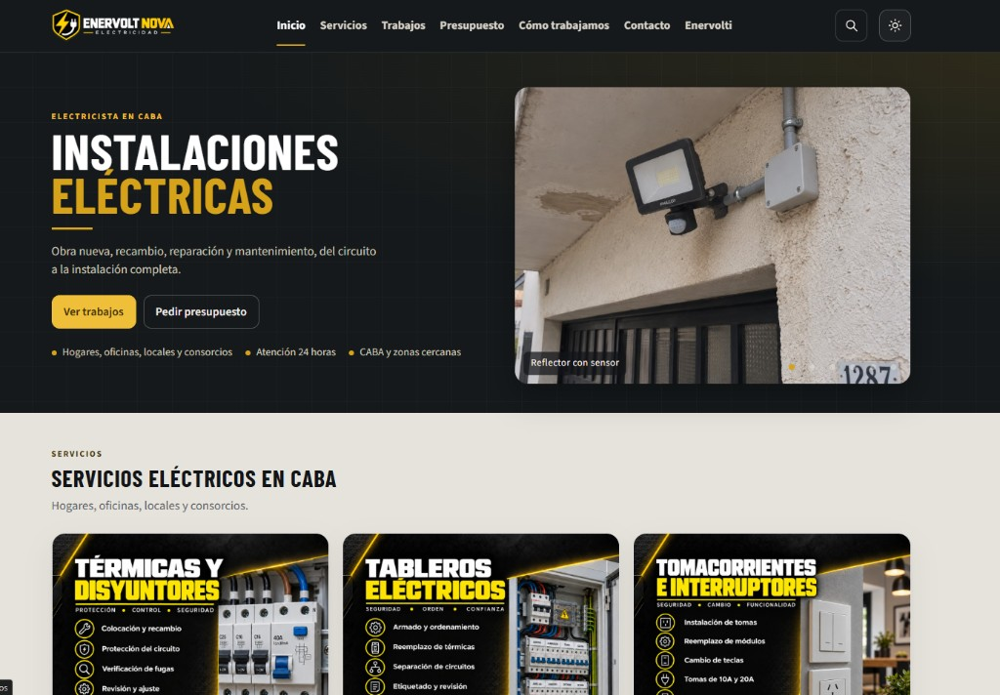
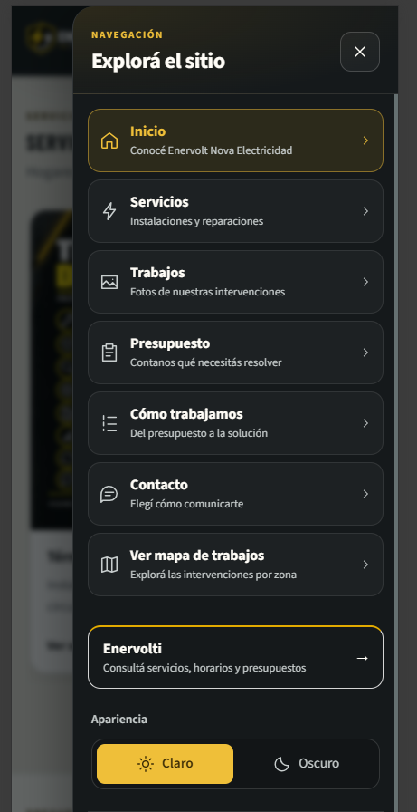
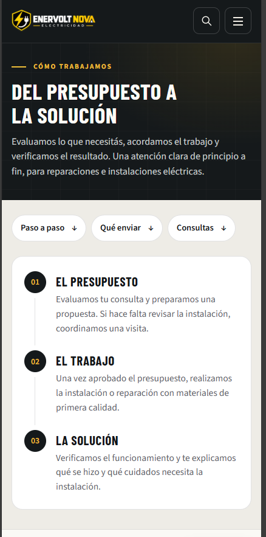
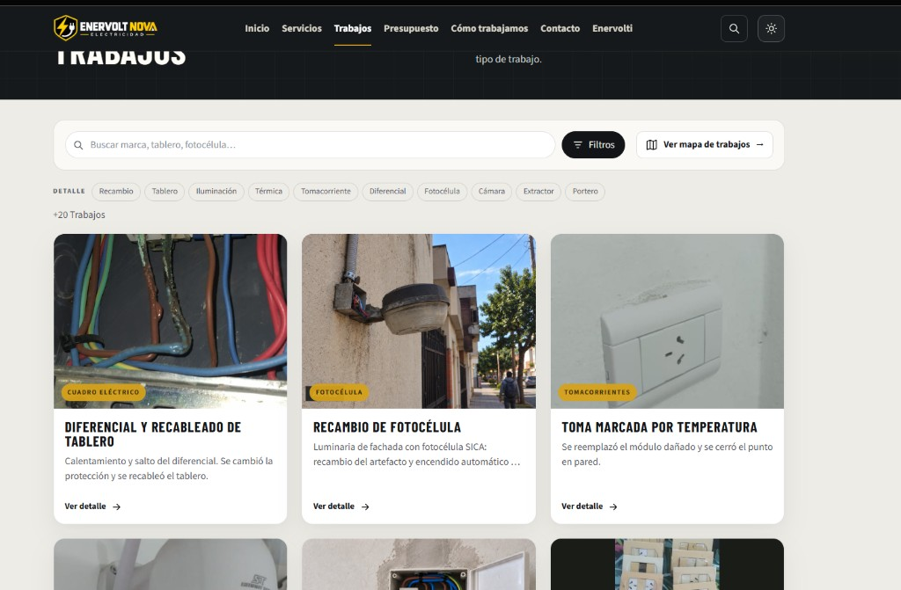
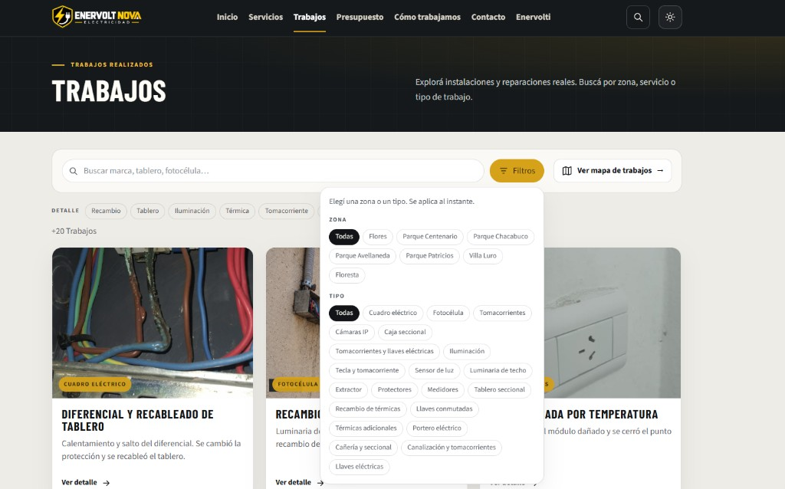
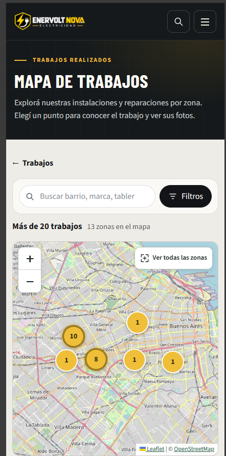
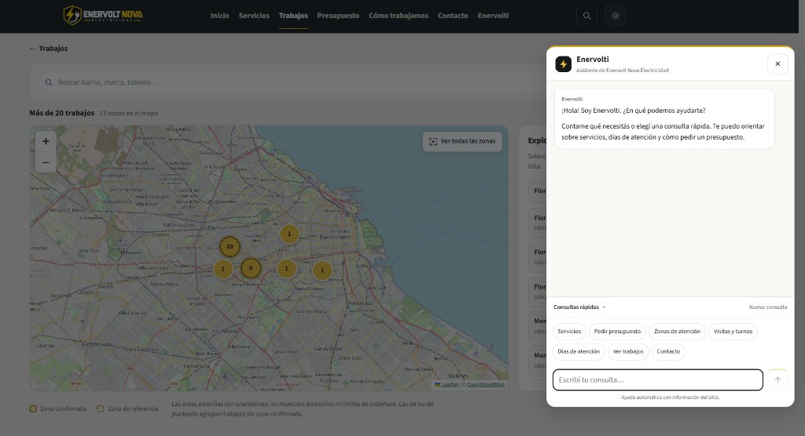
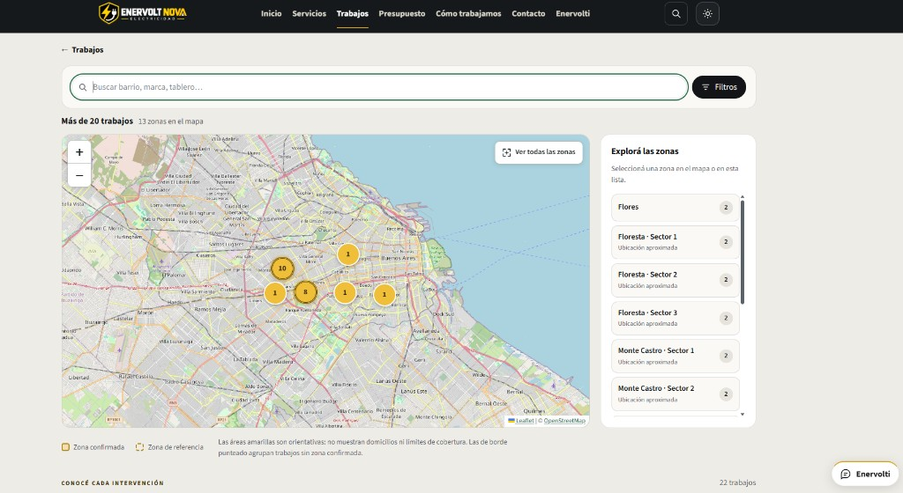
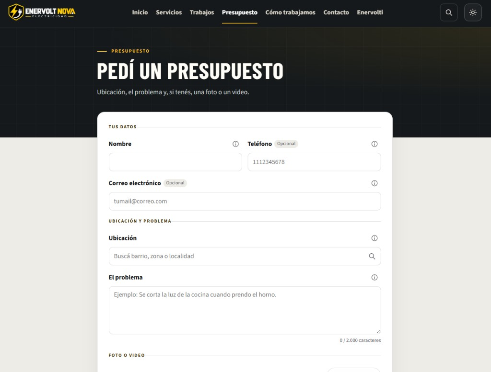
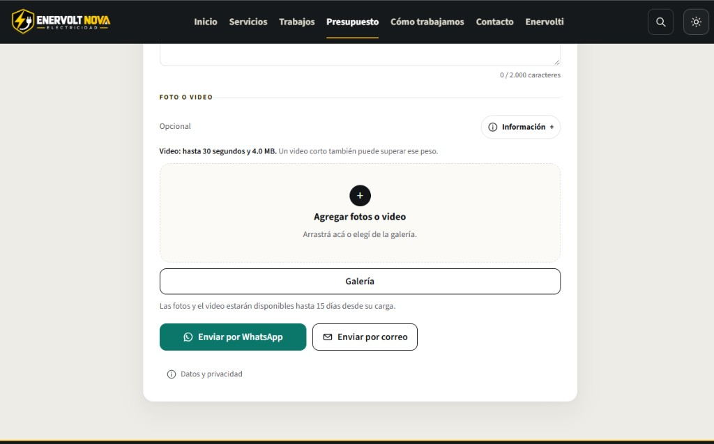

<div align="center">

<div align="right">


</div>
</div>

<br>

<br>

<div align="right">
  <a href="./README.md" title="Español">
    
  </a>
  <a href="./doc/assets/translation/README.en.md" title="Inglés">
    
  </a>
</div>

<div align="center">

# Enervolt Nova Electricidad 

</div>

Enervolt Nova Electricidad es el sitio de un servicio eléctrico para hogares, oficinas, locales y consorcios en CABA y zonas cercanas, con atención las 24 horas. El visitante encuentra servicios concretos, trabajos reales con foto y barrio, y un mapa para recorrer las intervenciones por zona. Si llega con una duda, Enervolti —el chat con inteligencia artificial del sitio— la responde al momento: servicios, cobertura, horarios, visitas y cómo pedir un presupuesto. Cuando quiere avanzar, indica la ubicación, cuenta el problema y puede sumar fotos o un video breve. El pedido queda listo para seguirlo por WhatsApp o por correo.

<div align="left">
<a href="https://enervoltnova.com/electricidad/" target="_blank" rel="noopener noreferrer" title="Ver live"></a>
</div>

<br>

## Índice 📜

<details>
  <summary> Ver detalle </summary>

<br>

<div align="right">

`Última actualización: 05/10/26`

</div>

### Sección 1) Descripción, configuración y tecnologías

* [1.0) Descripción.](#10-descripción-)
* [1.1) Ejecución.](#11-ejecución-)
* [1.2) Estructura.](#12-estructura-)
* [1.3) Tecnologías.](#13-tecnologías-)

### Sección 2) El sitio y el recorrido

* [2.0) Páginas.](#20-páginas-)
* [2.1) Servicios.](#21-servicios-)
* [2.2) Trabajos y mapa.](#22-trabajos-y-mapa-)
* [2.3) Presupuesto y contacto.](#23-presupuesto-y-contacto-)
* [2.4) Pedidos y vigencia.](#24-pedidos-y-vigencia-)

### Sección 3) Publicación, pruebas y referencias

* [3.0) Pruebas.](#30-pruebas-)
* [3.1) Sitio publicado (Vercel).](#31-sitio-publicado-vercel-)
* [3.2) Contribuir.](#32-contribuir-)
* [3.3) Referencias.](#33-referencias-)

</details>

<br>

## Sección 1) Descripción, configuración y tecnologías

### 1.0) Descripción [🔝](#índice-)

<details>
  <summary>Ver detalle</summary>

<br>

Este repositorio guarda la **documentación** del sitio. La aplicación vive en [Voltix_Electricidad_AW](https://github.com/andresWeitzel/Voltix_Electricidad_AW): React, Vite y TypeScript, con funciones en Vercel para los pedidos y un Worker de Cloudflare que publica todo bajo `/electricidad`.

Para qué existe:

* Mostrar el oficio con servicios, fotos y la zona de cada trabajo, en un sitio que se puede recorrer sin cuenta.
* Recibir una consulta con barrio o localidad del catálogo, una descripción y, si hace falta, fotos o un video breve.
* Dejar el pedido guardado y abrir WhatsApp o el correo con el mensaje ya armado. La página pública es [https://enervoltnova.com/electricidad/](https://enervoltnova.com/electricidad/).

Qué entrega el sitio:

* **Inicio**, con servicios, trabajos destacados y el camino para pedir un presupuesto.
* **Nueve servicios:** térmicas y disyuntores, tableros, tomacorrientes, iluminación, cableado, instalaciones nuevas, detección de fallas, porteros y electricidad para locales.
* **Catálogo de trabajos** con foto, zona y detalle, más un mapa para explorarlos por barrio.
* **Enervolti**, el chat del sitio. Orienta sobre servicios, zonas, horarios, visitas y presupuesto, y abre la página que corresponde. Las respuestas salen de la información publicada; no inventa precios ni diagnósticos.
* **Presupuesto** con ubicación del catálogo (48 barrios de CABA y localidades de Buenos Aires), validación compartida entre la web y el servidor, y envío por WhatsApp o correo.
* **Búsqueda** de servicios y trabajos, y apariencia clara u oscura.
* **Cómo trabajamos** y **Contacto**, con atención las 24 horas, incluidos fines de semana.
* **Páginas legales** estáticas: privacidad y condiciones, legibles sin JavaScript.
* **HTML de producción** con título, descripción y datos estructurados por página, más `sitemap.xml`.

El contacto público (WhatsApp, teléfono y correo) está definido en `shared/contacto.js` de la aplicación. No depende de variables de entorno.

</details>

### 1.1) Ejecución [🔝](#índice-)

<details>
  <summary>Ver detalle</summary>

<br>

La aplicación se corre desde el repositorio de código, no desde esta documentación.

* Clonar y entrar:

```bash
git clone https://github.com/andresWeitzel/Voltix_Electricidad_AW.git
cd Voltix_Electricidad_AW
```

* Instalar, preparar el entorno local y arrancar:

```bash
npm install
cp .env.example .env.local
npm run dev
```

El sitio queda en el puerto que indica Vite. Usamos **`.env.local` como único archivo local de configuración**. Está excluido de Git. `.env.example` es la plantilla versionada, sin credenciales. Los teléfonos y el correo se cambian en `shared/contacto.js`, no en el entorno.

En CI se usa **Node.js 22**.

#### Scripts útiles

| Script | Descripción |
| --- | --- |
| `npm run dev` | Servidor de desarrollo de Vite |
| `npm run build` | TypeScript, build de Vite, SEO y Worker de Cloudflare |
| `npm run preview` | Sirve el build estático (sin las funciones de pedidos) |
| `npm test` | Tests nativos (`node --test`) |
| `npm run lint` | oxlint |
| `npm run cloudflare:build` | Regenera el Worker con el 404 del dominio |
| `npm run storage:check` | Prueba real de escritura y lectura en el almacenamiento configurado |
| `npm run drive:connect` | Conecta, en local, la cuenta propietaria de Google Drive |

El detalle de Drive, Vercel y el cron de limpieza está en el README de la aplicación. No subas `.env.local`.

</details>

### 1.2) Estructura [🔝](#índice-)

<details>
  <summary>Ver detalle</summary>

<br>

Documentación (este repositorio):

```text
Enervolt_Nova_Electricidad_Doc/
├── doc/
│   └── assets/
│       ├── enervolt-background.es.png   # Cabecera del README en español
│       ├── enervolt-background.en.png   # Cabecera del README en inglés
│       ├── icons/                       # Badges, píldoras e iconos de tecnologías
│       ├── pruebas/                     # Capturas del sitio publicado
│       └── translation/
│           ├── arg-flag.jpg             # Bandera: español
│           ├── eeuu-flag.jpg            # Bandera: inglés
│           └── README.en.md             # Documentación en inglés
└── README.md                            # Documentación en español
```

Aplicación:

```text
Voltix_Electricidad_AW/
├── api/                                 # Funciones HTTP de Vercel
│   ├── pedido.js                        # Guarda la solicitud
│   ├── pedido-archivo.js                # Sube cada adjunto
│   ├── solicitud.js                     # Consulta pública del pedido
│   ├── archivo.js
│   ├── estado.js                        # Diagnóstico de configuración
│   └── limpieza-pedidos.js              # Barrido diario
├── cloudflare/
│   └── electricidad-router.js           # Prefijo /electricidad y 404 de la raíz
├── public/
│   ├── brand/                           # Logo y portada social
│   ├── privacidad.html
│   └── condiciones.html
├── server/                              # Drive, validación de almacenamiento, limpieza
├── shared/                              # Contacto, zonas, retención, archivos, validación
├── src/
│   ├── components/
│   ├── data/                            # Servicios, trabajos, SEO, textos del sitio
│   ├── hooks/
│   ├── lib/
│   ├── modules/asistente/
│   ├── pages/                           # Inicio, servicios, trabajos, mapa, presupuesto
│   └── App.tsx                          # Rutas de React Router
├── tests/
├── vercel.json                          # Rewrites, redirecciones y cron
├── vite.config.ts
└── package.json
```

</details>

### 1.3) Tecnologías [🔝](#índice-)

<details>
  <summary>Ver detalle</summary>

<br>

| **Tecnología** | **Versión** | **Propósito** |
| --- | --- | --- |
| [React](https://react.dev/) | **19.2** | **Interfaz** |
| [React Router](https://reactrouter.com/) | **7.18** | **Rutas del sitio** |
| [TypeScript](https://www.typescriptlang.org/) | **6.0** | **Tipos de la aplicación** |
| [Vite](https://vite.dev/) | **8.3** | **Desarrollo y build** |
| [Node.js](https://nodejs.org/) | **22** | **Tests, scripts y funciones** |
| [Leaflet](https://leafletjs.com/) | **1.9** | **Mapa de trabajos** |
| [Vercel](https://vercel.com/) | **Hosting** | **Sitio, funciones y cron** |
| [Cloudflare Workers](https://developers.cloudflare.com/workers/) | **Worker** | **Dominio público `/electricidad`** |
| [Google Drive API](https://developers.google.com/workspace/drive/api/guides/about-sdk) | **drive.file** | **Pedidos y adjuntos** |
| [oxlint](https://oxc.rs/docs/guide/usage/linter.html) | **1.81** | **Lint** |
| npm | **cli** | **Dependencias** |
| Git | **cli** | **Versiones** |

**Docs oficiales:**

* React: https://react.dev/
* Vite: https://vite.dev/
* Leaflet: https://leafletjs.com/
* Vercel: https://vercel.com/docs
* Cloudflare Workers: https://developers.cloudflare.com/workers/

</details>

<br>

## Sección 2) El sitio y el recorrido

### 2.0) Páginas [🔝](#índice-)

<details>
  <summary>Ver detalle</summary>

<br>

En local las rutas salen de la raíz. En el dominio público llevan el prefijo `/electricidad`. El Worker lo quita antes de consultar el origen en Vercel.

| Página | Local | Pública |
| --- | --- | --- |
| Inicio | `/` | https://enervoltnova.com/electricidad/ |
| Servicios | `/servicios` | https://enervoltnova.com/electricidad/servicios |
| Detalle de servicio | `/servicios/:id` | https://enervoltnova.com/electricidad/servicios/:id |
| Trabajos | `/trabajos` | https://enervoltnova.com/electricidad/trabajos |
| Mapa | `/trabajos/mapa` | https://enervoltnova.com/electricidad/trabajos/mapa |
| Detalle de trabajo | `/trabajos/:slug` | https://enervoltnova.com/electricidad/trabajos/:slug |
| Presupuesto | `/presupuesto` | https://enervoltnova.com/electricidad/presupuesto |
| Cómo trabajamos | `/como-trabajamos` | https://enervoltnova.com/electricidad/como-trabajamos |
| Contacto | `/contacto` | https://enervoltnova.com/electricidad/contacto |
| Búsqueda | `/buscar` | uso interno del sitio |

`/proceso` redirige a `/como-trabajamos`. `/home` vuelve al inicio. Una ruta inexistente dentro de Electricidad muestra la página propia de no encontrado. Fuera de `/electricidad`, en `enervoltnova.com`, el Worker responde 404 sin consultar el origen.

</details>

### 2.1) Servicios [🔝](#índice-)

<details>
  <summary>Ver detalle</summary>

<br>

El catálogo está en `src/data/servicios.ts`. Cada ficha tiene resumen, qué incluye y ejemplos de trabajos.

| Id | Servicio |
| --- | --- |
| `termicas` | Térmicas y disyuntores |
| `tableros` | Tableros eléctricos |
| `tomas` | Tomacorrientes e interruptores |
| `luminarias` | Iluminación y luminarias |
| `cableado` | Cableado y canalización |
| `nuevas` | Instalaciones nuevas |
| `fallas` | Detección de fallas |
| `porteros` | Porteros y timbres |
| `locales` | Electricidad para locales |

La cobertura visible es CABA y zonas cercanas. Los barrios del catálogo de trabajos muestran intervenciones publicadas; no marcan el límite de la zona de atención.

</details>

### 2.2) Trabajos y mapa [🔝](#índice-)

<details>
  <summary>Ver detalle</summary>

<br>

`src/data/trabajos.ts` describe cada intervención: tipo, zona, resumen y fotos. La galería filtra por tipo y por barrio, y esos filtros quedan en la URL.

El mapa usa **Leaflet** sobre **OpenStreetMap**. Al alejar la vista, las zonas cercanas se agrupan y suman sus trabajos; al activar un grupo, el mapa se acerca. Las referencias del mapa son aproximadas: no son domicilios de clientes.

El build genera un HTML propio para la galería, el mapa, cada servicio y cada trabajo, con la foto ya incluida, para que un enlace directo tenga título y contenido antes de ejecutar JavaScript.

</details>

### 2.3) Presupuesto y contacto [🔝](#índice-)

<details>
  <summary>Ver detalle</summary>

<br>

El formulario pide nombre, ubicación y una descripción del trabajo. Teléfono y correo son opcionales. Las fotos y un video breve también. La ubicación se elige de un catálogo local: 48 barrios de CABA y las localidades de la provincia de Buenos Aires. El mismo contrato (`shared/validacion-pedido.js` y `shared/zonas-pedido.js`) corre en el navegador y en el servidor.

Al elegir una zona aparece un mapa de referencia. Ese mapa no participa en la validación ni en el envío: si el proveedor no responde, la consulta se puede completar igual.

Dos caminos de salida, después de guardar:

* **WhatsApp** abre el chat con el mensaje preparado.
* **Correo** abre el cliente con `mailto:`.

La página no envía el mensaje por su cuenta. El usuario lo confirma en WhatsApp o en su correo.

Contacto público del sitio:

| Dato | Uso |
| --- | --- |
| WhatsApp `5491125151958` | Destinatario del pedido |
| Teléfono `1131096122` | Contacto para llamar |
| `enervoltnova.electricidad@gmail.com` | Presupuesto y consultas |
| Av. Lacarra 296, CABA | Dirección de referencia |
| Abierto 24 horas | Todos los días |

`/contacto` presenta esos canales. El formulario está en `/presupuesto`.

</details>

### 2.4) Pedidos y vigencia [🔝](#índice-)

<details>
  <summary>Ver detalle</summary>

<br>

`POST /api/pedido-archivo` sube cada archivo y `POST /api/pedido` guarda la solicitud. **Google Drive es el almacenamiento remoto.** El sitio sigue navegable si esas funciones fallan; el formulario conserva lo cargado y permite reintentar o enviar solo el texto.

Los originales y el JSON del pedido vencen a los **quince días** desde la carga. El enlace público (`/p/<solicitud>`) avisa la fecha límite. Una consulta vencida puede responder `410` mientras el archivo existe, y `404` después del barrido. El cron diario está declarado en `vercel.json` (`GET /api/limpieza-pedidos`, 09:00 UTC).

La vista previa del enlace usa el título **Pedido de presupuesto · Enervolt Nova Electricidad** y la descripción fija `enervoltnova.com/electricidad`. El problema del cliente no va en esa vista previa.

Páginas legales:

* Privacidad: https://enervoltnova.com/electricidad/privacidad.html
* Condiciones: https://enervoltnova.com/electricidad/condiciones.html

</details>

<br>

## Sección 3) Publicación, pruebas y referencias

### 3.0) Pruebas [🔝](#índice-)

<details>
  <summary>Ver detalle</summary>

<br>

#### 3.0.1) Recorrido del sitio publicado

Capturas de [enervoltnova.com/electricidad](https://enervoltnova.com/electricidad/). La cabecera de este README es el inicio en escritorio. Acá sigue el resto del recorrido: navegación, cómo trabajamos, trabajos, mapa, Enervolti y el formulario de presupuesto.

<div align="center">

| Navegación | Cómo trabajamos |
| --- | --- |
|  |  |

| Trabajos | Filtros |
| --- | --- |
|  |  |

| Mapa | Enervolti |
| --- | --- |
|  |  |


<br>
<sub>Mapa de trabajos</sub>

<br>

| Presupuesto | Envío |
| --- | --- |
|  |  |

</div>

#### 3.0.2) Tests automatizados

En el repositorio de la aplicación:

```bash
npm test
npm run lint
npm run build
```

`npm test` usa `node --test` sobre `tests/*.test.mjs`: navegación, mapa, pedidos, almacenamiento simulado, permisos de Drive, el Worker de Cloudflare y el contrato de validación. No hace falta un servidor aparte. `npm run storage:check` es la prueba que sí contacta al almacenamiento configurado; no reemplaza a los tests simulados.

GitHub Actions corre el mismo conjunto en cada push y en los pull requests hacia `master`.

</details>

### 3.1) Sitio publicado (Vercel) [🔝](#índice-)

<details>
  <summary>Ver detalle</summary>

<br>

Página pública: **[https://enervoltnova.com/electricidad/](https://enervoltnova.com/electricidad/)**

| Pieza | Rol |
| --- | --- |
| Vercel | Build (`npm run build`), funciones `/api` y cron de limpieza |
| `electricidad.enervoltnova.com` | Origen del Worker. No se elimina ni se redirige desde el panel de dominios |
| Cloudflare Worker | Publica el sitio en `enervoltnova.com/electricidad/` y responde 404 fuera de ese prefijo |

El Worker está en `cloudflare/electricidad-router.js`. Quita `/electricidad` antes de consultar Vercel y agrega la marca `x-enervolt-proxy: electricidad`. `vercel.json` redirige con 308 las visitas directas al subdominio que no traen esa marca, para que terminen en el dominio público.

Orden de publicación cuando cambia el 404 o el enrutado: primero el Worker (`npm run cloudflare:build` y deploy en Cloudflare), después el proyecto en Vercel. El build de Vercel solo no actualiza el código pegado en el Worker.

</details>

### 3.2) Contribuir [🔝](#índice-)

<details>
  <summary>Ver detalle</summary>

<br>

1. Fork del repositorio de la aplicación, o de este si el cambio es solo de documentación.
2. Creá una rama (`git checkout -b feature/mi-mejora`).
3. Commit (`git commit -m 'feat: descripción corta'`).
4. Push (`git push origin feature/mi-mejora`).
5. Abrí un Pull Request.

No subas `.env.local` ni credenciales. Si cambia una variable, documentala en `.env.example` de la aplicación y en ambos README (inglés y este).

</details>

### 3.3) Referencias [🔝](#índice-)

<details>
  <summary>Ver detalle</summary>

<br>

Desarrollado por Andrés Weitzel.

**Links:**

* **Sitio:** [enervoltnova.com/electricidad](https://enervoltnova.com/electricidad/)
* **Aplicación:** [github.com/andresWeitzel/Voltix_Electricidad_AW](https://github.com/andresWeitzel/Voltix_Electricidad_AW)
* **README en inglés:** [doc/assets/translation/README.en.md](./doc/assets/translation/README.en.md)
* **Perfil de la empresa:** [Enervolt Nova Electricidad en Google](https://www.google.com/maps/place/Enervolt+Nova+Electricidad/data=!4m2!3m1!1s0x0:0xcb27b0a80c78e048)

</details>
